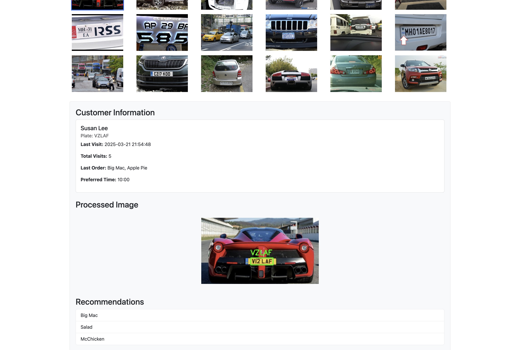

# License Plate Recognition using Observability Stack

This repo runs a small demo stack consisting of several microservices and observability tools. The `lpr-api` (FastAPI) service allows you to upload an image, detects cars in the image, and attempts OCR on license plates. The `customer-api` (FastAPI) service looks up customer information by plate number. The `web-ui` (nginx) serves the frontend application at `app/templates/index.html`. The stack also includes OpenTelemetry Collector, Jaeger, and Prometheus for observability and monitoring.




## Run
From the repo root:

```bash
docker compose up --build
```

Then open:
- Web UI: http://localhost:8080
- LPR API: http://localhost:8000/docs
- Customer API: http://localhost:8001/docs
- Jaeger: http://localhost:16686
- Prometheus: http://localhost:9090

## Quick test (API)
Upload an image to the LPR API:

```bash
curl -F "file=@test_image.jpg" http://localhost:8000/detect_plate/
```

Lookup a known demo customer plate:

```bash
curl http://localhost:8001/customer/WOR516K
```

